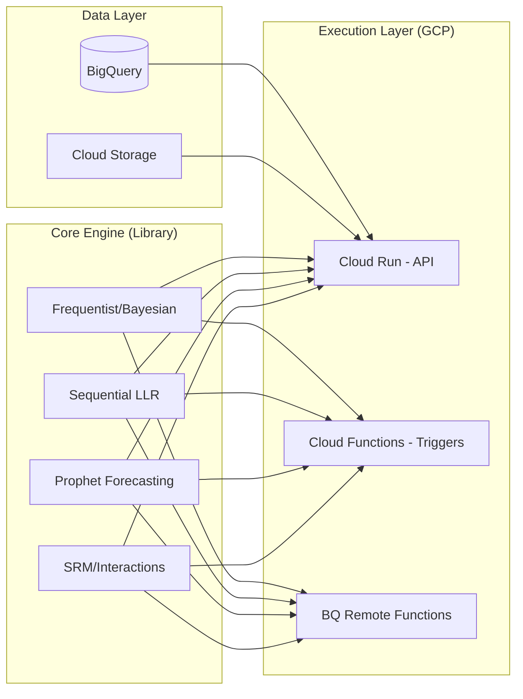

# First Order Engine

**First Order Engine** is a high-fidelity statistical framework designed for end-to-end experimentation analysis. It moves beyond basic A/B testing by synthesizing multiple statistical methodologies: Bayesian, Frequentist, and Sequential - into a single, unified source of truth for agency-grade decision-making.

---

## The Anatomy of the Name

* **First Order:** Refers to **First-Order Logic** and **First-Order Principles**. It signifies that the engine performs foundational, predicate-based reasoning on raw data, stripping away marketing noise to find the fundamental mathematical truth of an effect.
* **Engine:** Built for **Stateless Automation and Scale**. A high-performance computational layer designed to replace fragile spreadsheets with rigorous, repeatable, and cloud-decoupled code.

---

## Repository Structure

```text
first-order-engine/
│
├── pyproject.toml              # Installable as a package: pip install first-order-engine
├── README.md
├── .flake8                     # Linting configuration
├── .github/
│   └── workflows/
│       ├── test.yml            # Multi-version pytest on push
│       └── deploy.yml          # Parallel Cloud Function deployment on merge
│
├── foe/                        # Main importable package
│   ├── __init__.py
│   │
│   ├── core/                   # Shared primitives and Pydantic models
│   │   ├── models.py           # ExperimentInput, FrequentistResult, etc.
│   │   └── validators.py       # Data integrity guards
│   │
│   ├── frequentist/            # NHST Inference (p-values, Z-stats, CUPED)
│   ├── bayesian/               # Risk Analysis (Prob. of Being Best, AOV Projections)
│   ├── sequential/             # "Always Valid" mSPRT (LLR Trajectories)
│   ├── pretest/                # Planning (MDE Table, Sample Size, Prophet Forecasting)
│   ├── srm/                    # Data Quality (Chi-Squared Diagnostics)
│   ├── interaction/            # Factorial Analysis (Clash/Synergy Detection)
│   ├── behavioral/             # Skewed Metrics (Welch's t-test, Log-Transforms)
│   ├── continuous/             # Automated Decision Tree (ANOVA vs. Non-Parametric)
│   └── viz/                    # UI Adapters (JSON-ready chart coordinates)
│
├── gcp/                        # Google Cloud Platform adapter layer
│   └── functions/
│       ├── frequentist/
│       │   └── main.py         # Entry point → calls foe.frequentist
│       └── ...                 # Identical structure for all modules
│
└── tests/                      # Comprehensive Test Suite
    ├── unit/                   # Mathematical validation
    └── integration/            # End-to-end API handler tests
```

## System Design


## Core Algorithmic Pillars

The engine utilizes seven distinct layers of analysis to eliminate bias and maximize sensitivity:

### 1. Hybrid Inference (Bayesian & Frequentist)
FOE calculates both traditional **P-values** for significance thresholds and **Bayesian Posterior Probabilities** to provide intuitive "Probability of Being Best" metrics for stakeholders.

### 2. "Always Valid" Sequential Analysis
Unlike traditional alpha-spending models, FOE employs an **Always Valid** sequential method. By utilizing **Log-Likelihood Ratios (LLR)** and dynamic upper/lower bounds based on $\alpha$ and $\beta$, the engine allows for continuous monitoring and "early exit" functionality without inflating Type I error or requiring a fixed sample size.

### 3. Automated SRM Detection
Sample Ratio Mismatch (SRM) is the "silent killer" of experiments. The engine continuously monitors traffic distributions using Chi-Squared goodness-of-fit tests to flag data quality issues in real-time.

### 4. Interaction & Interference Analysis
FOE identifies how Test 1 affects Test $N$. It quantifies interaction effects in overlapping segments, ensuring that "hidden" correlations don't lead to false conclusions in complex testing environments.

### 5. Automated Decision Trees
Not all data is Normal. The engine automatically evaluates data distribution (Normality/Variance) to choose the mathematically correct test—dynamically switching between **ANOVA**, **Welch's**, and **Non-Parametric** (Mann-Whitney/Kruskal-Wallis) models.

### 6. Advanced Test Planning
Integrated duration calculators ensure every experiment is sized correctly for the expected MDE (Minimum Detectable Effect).

### 7. Strategic Synthesis
The engine doesn't just output raw tensors; it performs a final Synthesis. By balancing Frequentist certainty and Bayesian risk, FOE generates a **Natural Language Verdict**. It translates complex stats into definitive business actions: Winner Declared, Loss Averted, or Continue Testing.

---

## Technical Overview

The engine is designed to be integrated into modern data stacks.

* **Sequential Logic:** LLR-based bounds derived from $\alpha$ (Type I error) and $\beta$ (Type II error), ensuring validity at any sample size ($n$).
* **Safeguards:** Built-in protection against Simpson’s Paradox, Outlier Variance, and False Discovery Rates (FDR).
* **Goal:** To transform raw experimental data into a "Synthesis": a hardened, strategic business truth.

---

## Why First Order Engine?

Standard tools tell you **what** happened. The **First Order Engine** tells you **why** it happened, how much it is actually worth in the long run, and, most importantly, whether the result is mathematically bulletproof regardless of when you stopped the test.

---
*Developed for high-stakes experimentation and strategic growth analysis.*
