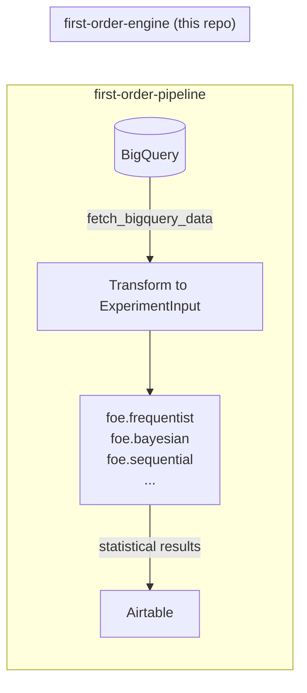

# First Order Engine

**First Order Engine (FOE)** is a high-fidelity statistical framework designed for end-to-end experimentation analysis. It moves beyond basic A/B testing by synthesizing multiple statistical methodologies — Bayesian, Frequentist, and Sequential — into a single, unified source of truth for agency-grade decision-making.

FOE is, by default, a **pure Python library**. It has no opinion about where your data comes from, where your results go, or what infrastructure you run it on. It is imported and called; everything else is someone else's job. The one deliberate exception is `foe.data` (see [Data Extraction](#data-extraction-opt-in) below) — isolated, opt-in, and never imported by any stats engine.

---

## The Anatomy of the Name

* **First Order:** Refers to **First-Order Logic** and **First-Order Principles**. It signifies that the engine performs foundational, predicate-based reasoning on raw data, stripping away marketing noise to find the fundamental mathematical truth of an effect.
* **Engine:** Built for **Stateless Automation and Scale**. A high-performance computational layer designed to replace fragile spreadsheets with rigorous, repeatable, platform-agnostic code.

---

## Two-Repository Architecture

FOE is one half of a two-repository system. The separation of concerns is deliberate:

| Repository | Role |
|---|---|
| **`first-order-engine`** *(this repo)* | Pure Python library. Statistical computation only, plus one opt-in exception: `foe.data` (BigQuery/GA4 extraction — see below), gated behind an extra and never imported by the stats engines. |
| [`first-order-pipeline`](https://github.com/BasLinders/first-order-pipeline) | ETL pipeline. Fetches data from BigQuery, imports FOE, runs the engines, pushes results to Airtable. |

The pipeline repo installs FOE as a dependency (`pip install git+https://github.com/BasLinders/first-order-engine.git@main`) and calls it like any other Python package. The stats engines (`foe.frequentist`, `foe.bayesian`, `foe.sequential`, etc.) never know or care that BigQuery or Airtable exist — `foe.data.DataEngine` is how a caller *gets* data into a shape those engines accept, not something the engines depend on.



This design means FOE can be integrated into any other platform — a Django app, a Streamlit dashboard, a Jupyter notebook, a different cloud provider — simply by importing it. The pipeline is an illustrative, production-ready reference implementation of one such integration.

---

## Repository Structure

```text
first-order-engine/
│
├── pyproject.toml               # Build config, dependencies, pytest & coverage settings
├── README.md
├── .flake8
├── .github/
│   └── workflows/
│       └── test.yml             # Lint + unit tests across Python 3.10–3.13
│
├── foe/                         # The importable package
│   ├── __init__.py
│   ├── core/
│   │   ├── models.py            # Pydantic input/output models (ExperimentInput, etc.)
│   │   ├── validators.py        # Cross-field validation logic
│   │   └── priors.py            # Informed Beta prior construction
│   ├── frequentist/
│   │   ├── operations.py        # FrequentistEngine (z-test, Sidak, bootstrap power)
│   │   └── confidence.py        # Non-inferiority testing
│   ├── bayesian/
│   │   └── operations.py        # BayesianEngine (Beta-Binomial, lift prior, monetary projection)
│   ├── sequential/
│   │   └── operations.py        # SequentialEngine (LLR bounds, trajectory processing)
│   ├── pretest/
│   │   ├── operations.py        # PretestEngine (sample size, MDE)
│   │   └── forecasting.py       # TrafficForecastingEngine: Prophet-based traffic forecasting
│   ├── forecasting/
│   │   └── operations.py        # ForecastingEngine (conversions/revenue, holidays, covariates)
│   ├── srm/
│   │   └── operations.py        # SRMEngine (chi-squared traffic checks)
│   ├── interaction/
│   │   └── operations.py        # InteractionEngine (OLS interaction modelling)
│   ├── behavioral/
│   │   └── operations.py        # BehavioralEngine (funnel & segment analysis)
│   ├── continuous/
│   │   └── operations.py        # ContinuousMetricEngine (revenue, CUPED)
│   ├── viz/
│   │   └── operations.py        # VizEngine (JSON-ready chart coordinates)
│   └── data/                    # Opt-in I/O exception — requires `pip install foe[bigquery]`
│       ├── engine.py            # DataEngine (OAuth, BQ client, execution, extraction recipes)
│       └── sql/
│           ├── ga4.py           # Shared GA4 events_* primitives (table ref, date filter, escaping)
│           ├── experiments.py   # Baseline/binomial/continuous/sequential/interaction builders
│           ├── event_log.py     # Process-mining event-log extraction
│           └── timeseries.py    # Daily time-series extraction, feeds ForecastingEngine
│
└── tests/
    ├── conftest.py
    ├── test_core.py             # priors, validators, models
    ├── test_frequentist.py      # FrequentistEngine + confidence
    ├── test_bayesian.py         # BayesianEngine (probability + monetary)
    └── integration/
        └── test_api_handlers.py
```

---

## Quick Start

```python
from foe.core.models import ExperimentInput
from foe.frequentist.operations import FrequentistEngine
from foe.bayesian.operations import BayesianEngine, get_beta_prior, get_lift_prior

# --- Frequentist ---
data = ExperimentInput(
    visitors=[2000, 2000],
    conversions=[200, 260],
    labels=["Control", "Challenger"],
)

freq_results = FrequentistEngine().run_synthesis(data)
for r in freq_results:
    print(r.conclusion)

# --- Bayesian ---
bayes_results = BayesianEngine().run_probability_analysis(
    data=data,
    beta_prior=get_beta_prior(),
    lift_prior=get_lift_prior(0.0, "uninformative"),
)
for r in bayes_results:
    print(f"{r.variant_label}: {r.prob_being_best:.1%} probability of being best")
```

**Installation:**
```bash
pip install git+https://github.com/BasLinders/first-order-engine.git@main
```

---

## Data Extraction (opt-in)

`foe.data.DataEngine` connects to BigQuery/GA4 and builds the SQL to extract
data — experiment exports for `PretestEngine`/the frequentist and Bayesian
engines, raw event logs for process mining, and daily time series for
`ForecastingEngine`. It is the one deliberate exception to "no I/O" above:
isolated in its own subpackage, gated behind an extra, and never imported by
any stats engine — installing plain `foe` never pulls in `google-cloud-bigquery`.

```bash
pip install "foe[bigquery]"
```

```python
from datetime import date
from foe.core.models import BQConnectionConfig, DateRange, TimeSeriesExtractionParams, TimeSeriesMetric
from foe.data import DataEngine

engine = DataEngine.from_credentials(my_google_credentials, project="my-gcp-project")

params = TimeSeriesExtractionParams(
    connection=BQConnectionConfig(project="my-gcp-project", dataset="analytics_123456789"),
    date_range=DateRange(start_date=date(2026, 1, 1), end_date=date(2026, 6, 30)),
    metrics=[TimeSeriesMetric.VISITORS, TimeSeriesMetric.CONVERSIONS, TimeSeriesMetric.REVENUE],
)
daily_df = engine.extract_timeseries(params)  # -> straight into ForecastingEngine
```

`DataEngine.build_auth_url`/`exchange_code` handle Google's OAuth dance without
assuming any particular web framework — a caller (Streamlit, Flask, a CLI)
decides how the auth URL is served and how the resulting `Credentials` are
persisted between requests; DataEngine only knows about Google's OAuth/BigQuery
APIs. See `foe/data/engine.py` and `foe/core/models.py`'s "Data extraction"
section for the full surface.

---

## Core Algorithmic Pillars

### 1. Hybrid Inference (Bayesian & Frequentist)
FOE calculates both traditional **p-values** for significance thresholds and **Bayesian Posterior Probabilities** to provide intuitive "Probability of Being Best" metrics for stakeholders.

### 2. "Always Valid" Sequential Analysis
Unlike traditional alpha-spending models, FOE employs an **Always Valid** sequential method. By utilizing **Log-Likelihood Ratios (LLR)** and dynamic upper/lower bounds based on $\alpha$ and $\beta$, the engine allows for continuous monitoring and early-exit functionality without inflating Type I error or requiring a fixed sample size.

### 3. Automated SRM Detection
Sample Ratio Mismatch (SRM) is the "silent killer" of experiments. The engine monitors traffic distributions using Chi-Squared goodness-of-fit tests to flag data quality issues before they corrupt results.

### 4. Interaction & Interference Analysis
FOE identifies how Test 1 affects Test $N$. It quantifies interaction effects in overlapping segments, ensuring that hidden correlations don't lead to false conclusions in complex testing environments.

### 5. Automated Decision Trees
Not all data is Normal. The engine automatically evaluates data distribution (normality, variance) to choose the mathematically correct test — dynamically switching between **ANOVA**, **Welch's**, and **Non-Parametric** (Mann-Whitney / Kruskal-Wallis) models.

### 6. Advanced Test Planning
Integrated duration calculators ensure every experiment is sized correctly for the expected MDE (Minimum Detectable Effect), with analytical and bootstrap-based power estimates.

### 7. Strategic Synthesis
The engine doesn't just output raw numbers — it performs a final Synthesis. By balancing Frequentist certainty and Bayesian risk, FOE generates a **natural language verdict** that translates complex statistics into a definitive business action: Winner Declared, Loss Averted, or Continue Testing.

---

## Technical Overview

* **Sequential Logic:** LLR-based bounds derived from $\alpha$ (Type I error) and $\beta$ (Type II error), ensuring validity at any sample size ($n$).
* **Multiple Comparisons:** Šidák correction applied automatically when more than two variants are present.
* **Monetary Projection:** Beta-Binomial posterior combined with log-normal AOV sampling to produce expected uplift, risk, and net contribution over a configurable projection horizon.
* **Safeguards:** Built-in protection against Simpson's Paradox, outlier variance, and False Discovery Rates (FDR).

---

## Why First Order Engine?

Standard tools tell you **what** happened. The **First Order Engine** tells you **why** it happened, how much it is actually worth in the long run, and — most importantly — whether the result is mathematically bulletproof regardless of when you stopped the test.

---

*Developed for high-stakes experimentation and strategic growth analysis.*
