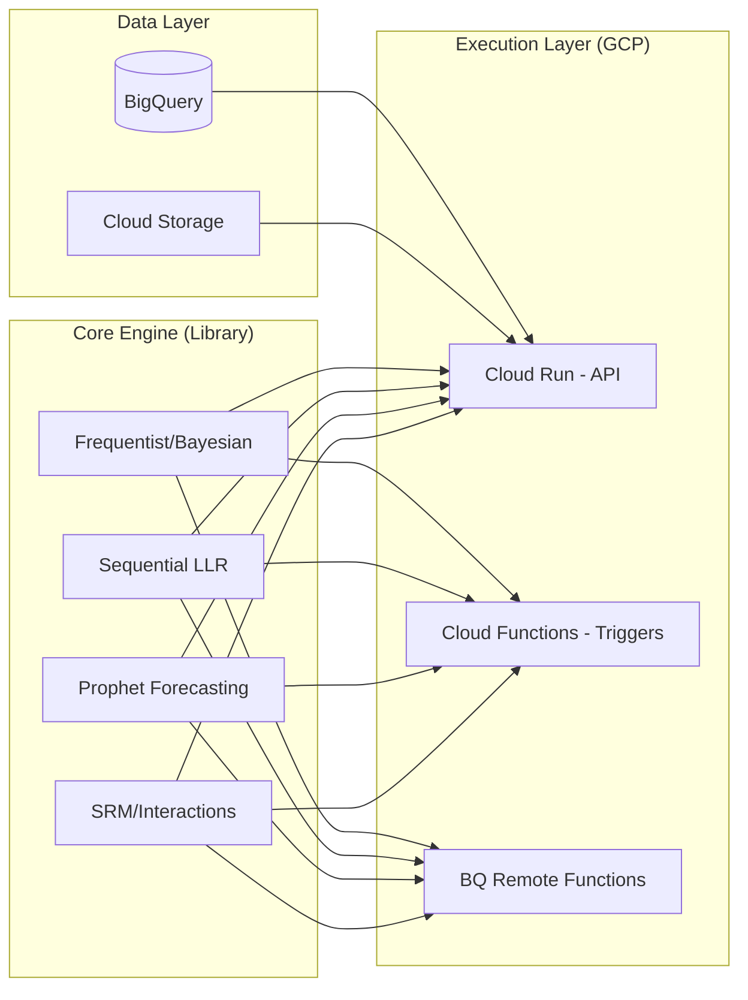

# Axiom Synthesis Engine

**Axiom Synthesis Engine** is a high-fidelity statistical framework designed for end-to-end experimentation analysis. It moves beyond basic A/B testing by synthesizing multiple statistical methodologies: Bayesian, Frequentist, and Sequential - into a single, unified source of truth for agency-grade decision-making.

---

## The Anatomy of the Name

* **Axiom:** Represents the **Test Planning** and **SRM** components. It ensures the foundation of every test is statistically sound—a "self-evident truth" established before analysis begins.
* **Synthesis:** Represents the **Interaction**, **Compound Growth**, and **Hybrid Inference** approach. The engine assembles complex, competing algorithms into one clear, actionable direction.
* **Engine:** Built for **Automation and Scale**. A high-performance computational layer designed to replace manual spreadsheets with rigorous, repeatable code.

---

## Repository Structure

```text
axiom/
│
├── pyproject.toml                  # installable as a package: pip install axiom
├── setup.cfg
├── README.md
├── .github/
│   └── workflows/
│       ├── test.yml                # pytest on push
│       └── deploy.yml              # deploy Cloud Functions on merge to main
│
├── engine/                         # main importable package
│   ├── __init__.py                 # exposes top-level API
│   │
│   ├── core/                       # shared primitives used by all modules
│   │   ├── __init__.py
│   │   ├── models.py               # dataclasses: AlternativeHypothesis, ExperimentInput, etc.
│   │   └── validators.py           # input validation (raises ValueError)
│   │
│   ├── frequentist/
│   │   ├── __init__.py
│   │   ├── operations.py           # run_ztest(), apply_sidak(), apply_cuped()
│   │   └── confidence.py           # compute_interval_difference(), compute_non_inferiority()
│   │
│   ├── bayesian/
│   │   ├── __init__.py
│   │   └── operations.py           # run_bayesian_core(), get_posterior_parameters(), run_multi_variant_risk_assessment(), 
│   │
│   ├── sequential/
│   │   ├── __init__.py
│   │   └── operations.py           # calculate_boundaries(), calculate_llr_vectorized(), estimate_remaining_time(), process_test_trajectory()
│   │
│   ├── pretest/
│   │   ├── __init__.py
│   │   ├── operations.py           # compute_sample_size(), compute_mde(), holm_bonferroni_correction(), get_z_alpha(), calculate_mde_table(), calculate_fixed_sample_size()
│   │   └── forecasting.py          # run_seasonal_forecast()
│   │
│   ├── srm/
│   │   ├── __init__.py
│   │   └── operations.py           # calculate_chi_squared(), diagnose_segments(), get_srm_thresholds()
│   │
│   ├── interaction/
│   │   ├── __init__.py
│   │   └── operations.py           # prepare_long_format(), fit_interaction_model(), format_summary_table()
│   │
│   ├── behavioral/
│   │   ├── __init__.py
│   │   └── operations.py           # detect_outliers_mask(), apply_transformations(), run_welch_inference()
│   │
│   ├── continuous/
│   |    ├── __init__.py
│   |    └── operations.py          # detect_outliers_ols(), winsorize_series(), run_comparison_suite()
|   |
|   └── viz/
|        ├── __init__.py
|        └── operations.py          # Various visualizations
│
├── gcp/                            # GCP adapter layer
│   ├── functions/
│   │   ├── frequentist/
│   │   │   └── main.py             # Cloud Function entry point → calls axiom.frequentist
│   │   ├── bayesian/
│   │   │   └── main.py
│   │   ├── sequential/
│   │   │   └── main.py
│   │   ├── pretest/
│   │   │   └── main.py
│   │   ├── srm/
│   │   │   └── main.py
│   │   └── ...
│   └── requirements.txt            # GCP-specific deps (functions-framework, etc.)
│
└── tests/
    ├── unit/
    │   ├── test_frequentist.py
    │   ├── test_bayesian.py
    │   ├── test_sequential.py
    │   ├── test_srm.py
    │   └── ...
    └── integration/
        └── test_gcp_handlers.py    # tests the Cloud Function wrappers end-to-end
```

## System Design


## Core Algorithmic Pillars

The engine utilizes seven distinct layers of analysis to eliminate bias and maximize sensitivity:

### 1. Hybrid Inference (Bayesian & Frequentist)
Axiom calculates both traditional **P-values** for significance thresholds and **Bayesian Posterior Probabilities** to provide intuitive "Probability of Being Best" metrics for stakeholders.

### 2. "Always Valid" Sequential Analysis
Unlike traditional alpha-spending models, Axiom employs an **Always Valid** sequential method. By utilizing **Log-Likelihood Ratios (LLR)** and dynamic upper/lower bounds based on $\alpha$ and $\beta$, the engine allows for continuous monitoring and "early exit" functionality without inflating Type I error or requiring a fixed sample size.

### 3. Automated SRM Detection
Sample Ratio Mismatch (SRM) is the "silent killer" of experiments. The engine continuously monitors traffic distributions using Chi-Squared goodness-of-fit tests to flag data quality issues in real-time.

### 4. Interaction & Interference Analysis
Axiom identifies how Test 1 affects Test $N$. It quantifies interaction effects in overlapping segments, ensuring that "hidden" correlations don't lead to false conclusions in complex testing environments.

### 5. Compound Growth Projection
Individual wins are temporary; growth is cumulative. This module forecasts the long-term impact of experimental lift over a 12-month horizon using compounding models to show true business value.

### 6. Advanced Test Planning
Integrated duration calculators ensure every experiment is sized correctly for the expected MDE (Minimum Detectable Effect).

### 7. Strategic Synthesis
A proprietary weighting layer that balances frequentist "Certainty" with Bayesian "Risk" to provide a final recommendation on whether to rollout, iterate, or kill a feature.

---

## Technical Overview

The engine is designed to be integrated into modern data stacks.

* **Sequential Logic:** LLR-based bounds derived from $\alpha$ (Type I error) and $\beta$ (Type II error), ensuring validity at any sample size ($n$).
* **Safeguards:** Built-in protection against Simpson’s Paradox, Outlier Variance, and False Discovery Rates (FDR).
* **Goal:** To transform raw experimental data into a "Synthesis": a hardened, strategic business truth.

---

## Why Axiom Synthesis?

Standard tools tell you **what** happened. The **Axiom Synthesis Engine** tells you **why** it happened, how much it is actually worth in the long run, and—most importantly—whether the result is mathematically bulletproof regardless of when you stopped the test.

---
*Developed for high-stakes experimentation and strategic growth analysis.*
